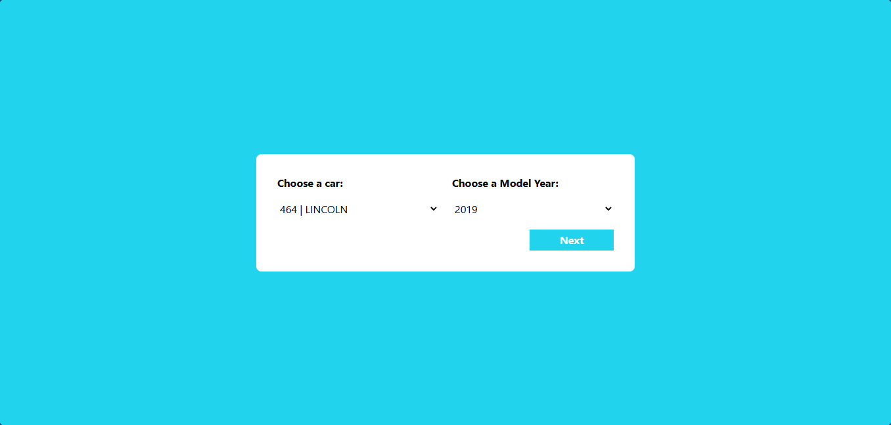
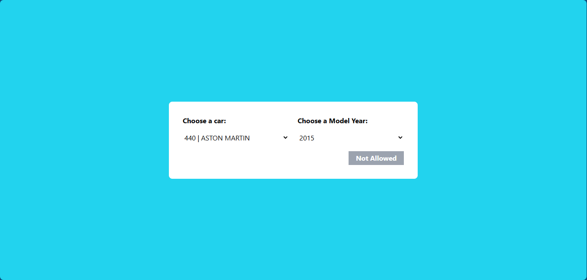
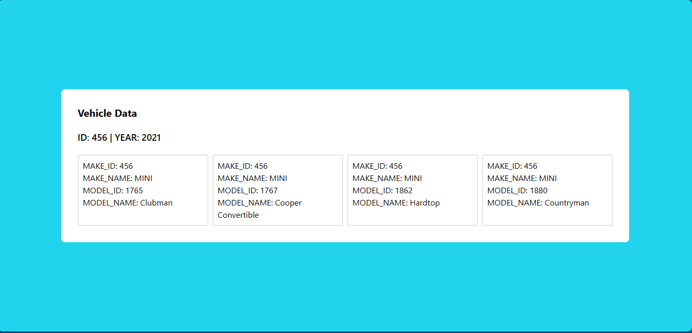

# CAR DEALER APP

Application that allows users to filter vehicles by type and model year, and view the results on a separate page(/result/id/year).

Demo: [car-dealer-app-demo.vercel.app](https://car-dealer-app-demo.vercel.app/)

## Screenshots




## Install the dependencies
```bash
npm install
```

## How to run

```bash
npm run dev
```

## How to build
```bash
npm run build
```

Open [http://localhost:3000](http://localhost:3000) with your browser to see the result.

## Tech Stack
- React: For building user interfaces.
- Next.js: Framework for React with built-in SSR and API handling.
- TypeScript: For type-safe JavaScript code.
- JavaScript: Core scripting language for dynamic behavior.

## Application Features
Vehicle Filtering: Users can filter vehicles by make and model year.
Dynamic Routes: Results are displayed on a separate page via dynamic routes.
API Integration: The app fetches vehicle data from external APIs using Axios.

### Description of Folders and Files
- **`/components`**: Contains reusable React components. Each component should have its own folder for easier maintenance.
  
- **`/models`**: Stores TypeScript interfaces and types, ensuring that the data structure is well-defined and consistent.

- **`/lib`**: Contains helper and API functions that encapsulate the logic for interacting with external services, separating this logic from the presentation of components.

## Environment Variables
To run the application successfully, you need to configure the following environment variables:

- NEXT_PUBLIC_MAKE_URL: The API URL to fetch vehicle makes.
- NEXT_PUBLIC_VEHICLE_URL: The base API URL for fetching vehicle details by make and year.